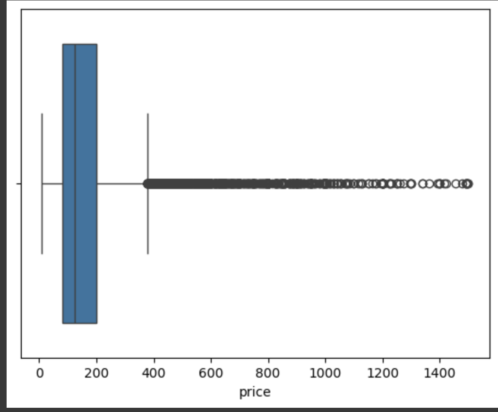
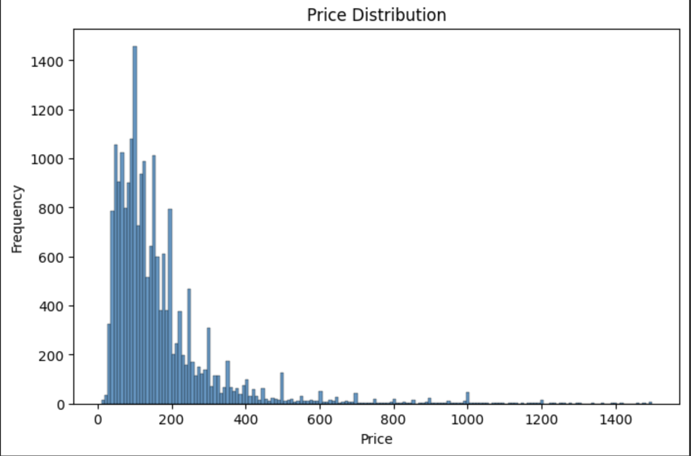
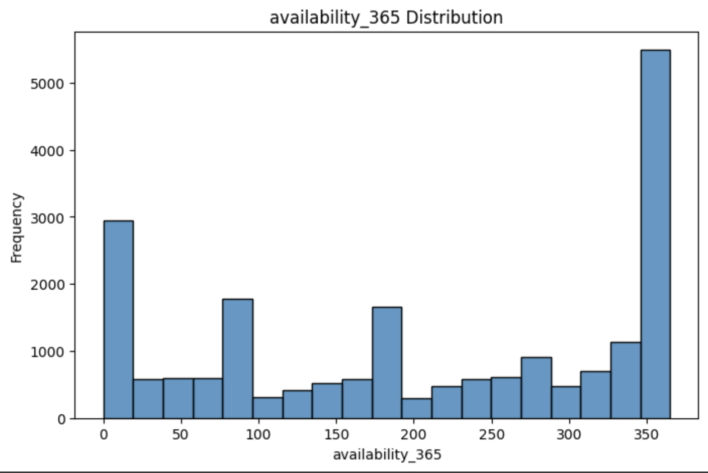
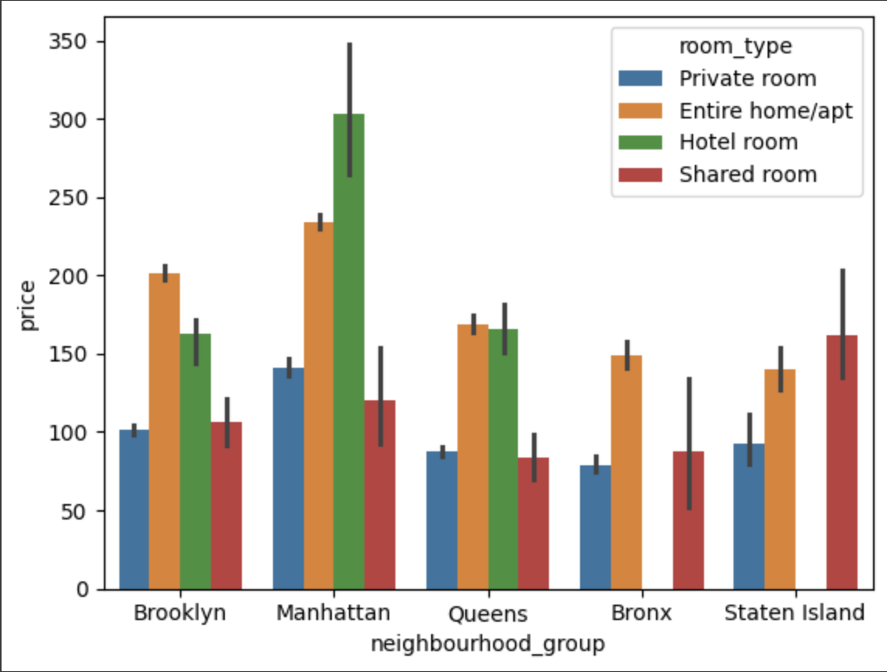
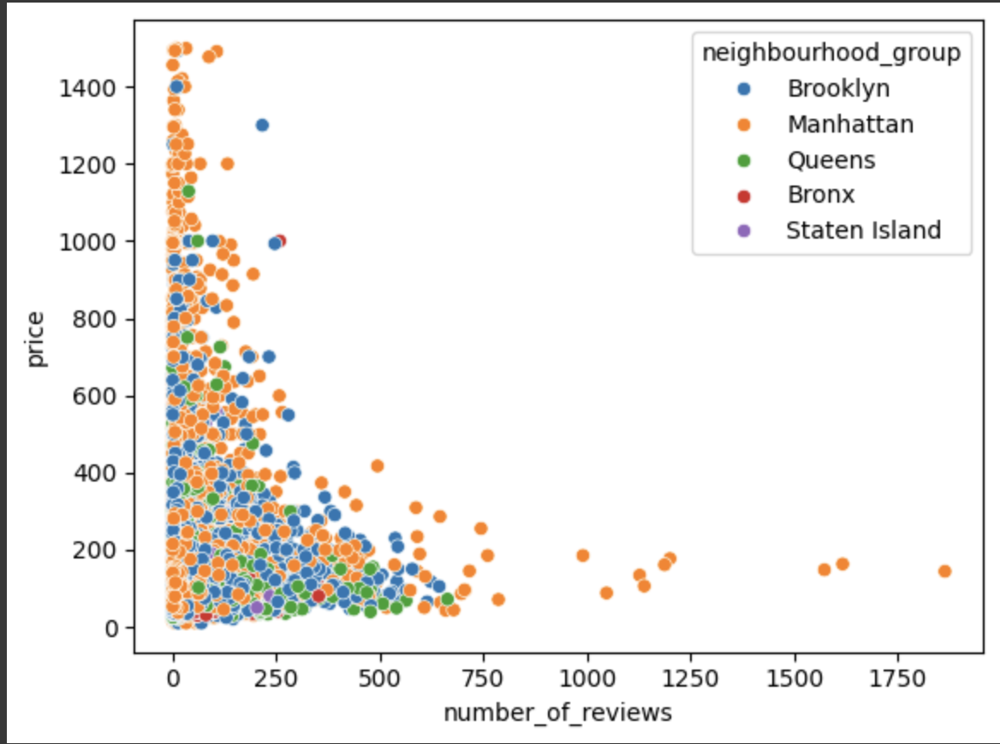
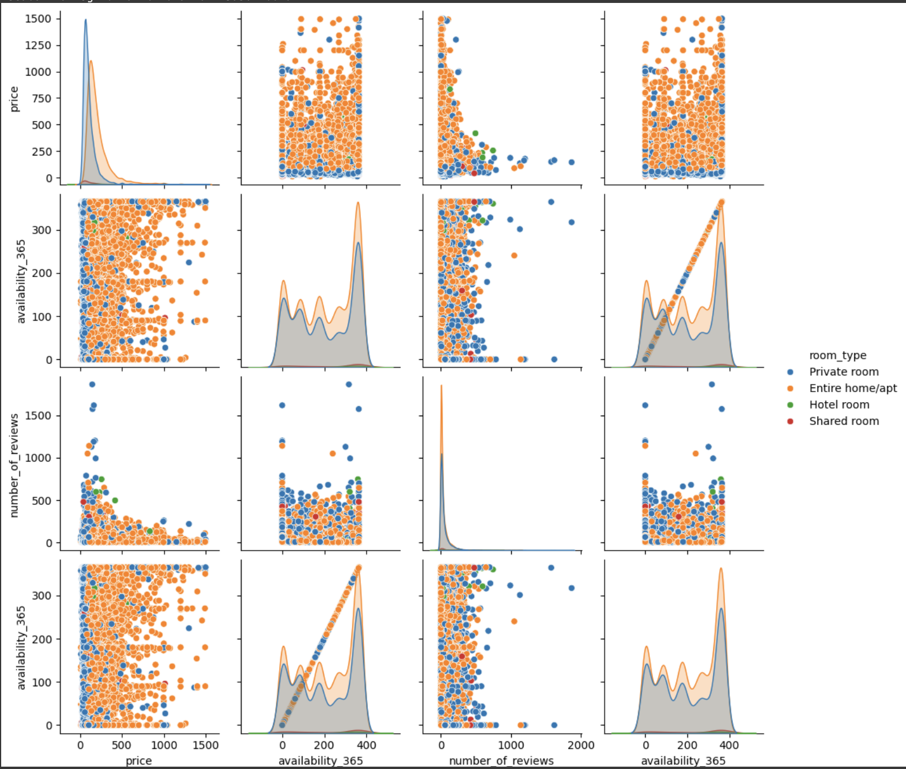
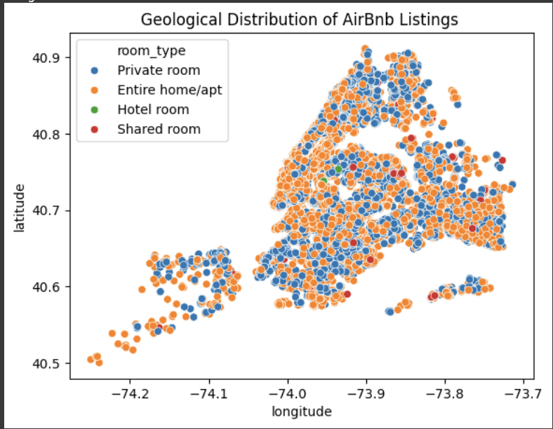
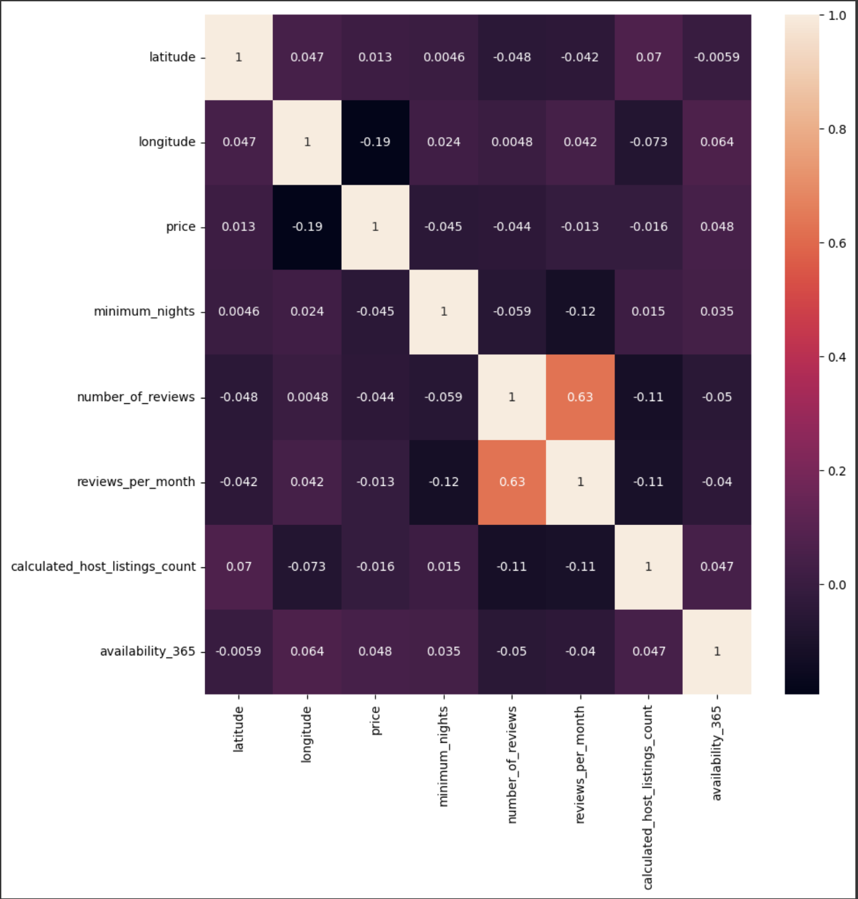

# 🏡 Airbnb Exploratory Data Analysis (EDA) Project  
### 📊 Python | Pandas | Seaborn | Matplotlib | Data Visualization

---

> **A deep-dive into Airbnb listings across NYC using exploratory data analysis to uncover patterns in pricing, availability, location, and room types.**

---

## 📁 Project Overview

This project presents a comprehensive EDA on **Airbnb listings data in New York City**. It explores distribution trends, location-based pricing, availability, and the impact of room types using rich visualizations and statistical insights.

📌 **Goal**: To identify key trends and factors that affect Airbnb listing prices and availability.  
🧠 **Outcome**: A clearer understanding of the Airbnb market in NYC to help with pricing strategies and listing optimization.

---

## 🧭 Steps Performed

1. **Dataset Import & Initial Exploration**  
   - Loaded the dataset and examined shape, columns, data types, and missing values.

2. **Data Cleaning**  
   - Removed unnecessary columns, handled missing values, and treated data inconsistencies.

3. **Univariate Analysis**  
   - Analyzed distributions of variables like `price`, `availability_365`, `room_type`, etc.

4. **Outlier Detection**  
   - Used boxplots to visualize price outliers and applied thresholds to manage skewness.

5. **Bivariate & Multivariate Analysis**  
   - Explored relationships between `price`, `room_type`, `neighbourhood_group`, `number_of_reviews`, and `availability`.

6. **Geospatial Analysis**  
   - Mapped listings using `latitude` and `longitude` to understand neighborhood clustering.

7. **Correlation Heatmap**  
   - Identified numeric correlations to detect strong/weak relationships across features.

8. **Visualization & Insights**  
   - Created insightful plots using Seaborn and Matplotlib to reveal patterns.

---

## 🛠️ Tools & Technologies

| Tool / Library     | Description                             |
|--------------------|-----------------------------------------|
| 🐍 Python           | Primary language                        |
| 📦 Pandas           | Data manipulation & wrangling           |
| 📈 Matplotlib       | Plotting library                        |
| 📊 Seaborn          | Statistical data visualization          |
| 🔍 Jupyter Notebook | Analysis workflow and execution         |

---

## 🔍 Key Insights

- 💲 **Price Distribution**: Listings are heavily right-skewed with many outliers.
- 🛏️ **Room Type Impact**: Entire apartments are priced higher than private/shared rooms.
- 🌆 **Neighbourhood Effect**: Manhattan consistently commands higher prices.
- 📅 **Availability**: Many listings are either always available or barely listed.
- 🗺️ **Geographic Hotspots**: Dense clustering in Manhattan and Brooklyn.

---

## 📸 Visual Highlights

### 1️⃣ Boxplot of Prices  
Shows a long right tail and presence of extreme price outliers.

---

### 2️⃣ Price Distribution Histogram  
Majority of listings are priced below $300, indicating a skewed distribution.

---

### 3️⃣ Availability Distribution  
Many listings are either fully available (365 days) or rarely available.

---

### 4️⃣ Price by Room Type and Neighbourhood  
Entire homes/apartments in Manhattan have the highest average prices.

---

### 5️⃣ Price vs Number of Reviews  
Listings with fewer reviews tend to have higher prices, indicating possible new or premium listings.

---

### 6️⃣ Pairplot: Multivariate Analysis  
Visualizing multiple variable relationships simultaneously segmented by room types.

---

### 7️⃣ Geographical Distribution of Listings  
Mapped spread of Airbnb listings in NYC. Heavy clustering in Manhattan and Brooklyn.

---

### 8️⃣ Correlation Heatmap  
Low correlation of price with most variables, but some insight from reviews and availability.

---

This project demonstrates my ability to:
- Clean, analyze, and visualize real-world data
- Translate patterns into business-relevant insights
- Communicate technical findings in an intuitive format

---
